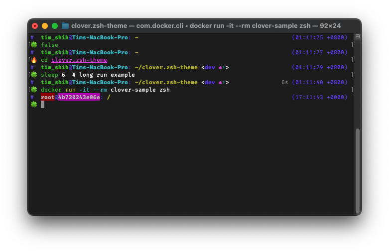

# Clover

🍀 a configurable theme for [zsh], inspired by [zeta-zsh-theme] and [pure].



[zsh]: https://en.wikipedia.org/wiki/Z_shell
[zeta-zsh-theme]: https://github.com/skylerlee/zeta-zsh-theme
[pure]: https://github.com/sindresorhus/pure

- Highlights environment changes

  Username and host changes the style for special environments: root, remote, container

- Async VCS status

  Background process, don't blocks your workflow

- Execution time

  Show human readable execution time for long run command

- Python

  Virtualenv prompt is included

- Show the error

  Prompt indicator changes whether the last run success (🍀/🔥)

- Configurable

  Read the configuration section below


## Installation

### [oh-my-zsh](https://github.com/ohmyzsh/ohmyzsh)

clone this repo into `$ZSH_CUSTOM`:

```bash
cd ${ZSH_CUSTOM:-"~/.oh-my-zsh/custom"}/themes
git clone git@github.com:tzing/clover.zsh-theme.git clover
```

then change the theme:

```zsh
ZSH_THEME="clover/clover"
```

### [zinit](https://github.com/zdharma-continuum/zinit)

```zsh
zinit light tzing/clover.zsh-theme
```

### Manual

clone this repo to somewhere you like:

```sh
git clone git@github.com:tzing/clover.zsh-theme.git <PATH>
```

and source the main script in your `.zshrc`

```zsh
source <PATH>/clover.zsh-theme
```


## Configurations

This theme reads the configurations from [`zstyle`]. All context name must be prefixed with `:prompt:clover:`. Styles are always configurable, and for some components you could also customized the symbols.

Here's a disgram that shows context names:

```none
   ┌---------------------------------------------------------------------- user
   |    ┌----------------------------------------------------------------- host
   |    |         ┌------------------------------------------------------- path
   |    |         |                   ┌----------------------------------- vcs:branch
   |    |         |                   |    ┌------------------------------ vcs:status (read details below)
   |    |         |                   |    |          ┌------------------- execution-time
   |    |         |                   |    |          |    ┌-------------- current-time
#  user@hostname: ~/clover.zsh-theme <main ✔⇡>        10s (12:00:00 +0800)
(.venv) 🍀
 |      └----------------------------------------------------------------- prompt
 └------------------------------------------------------------------------ virtualenv
```

[`zstyle`]: https://zsh.sourceforge.io/Doc/Release/Zsh-Modules.html#index-zstyle

> [!NOTE]
>
> VCS information (`:prompt:clover:vcs:*`) are evaluated in background process, which is forked in first [precmd] run.
> Runtime zstyle settings will not take effect. But you could still change the style in `.zshrc`.
>
> [precmd]: https://zsh.sourceforge.io/Doc/Release/Functions.html#index-precmd

### Styles

Run zstyle command with the key `style`. And the value could be the [visual effect] expresssion in zsh prompt expansion.

[visual effect]: https://zsh.sourceforge.io/Doc/Release/Prompt-Expansion.html#Visual-effects

An example of setting the path to bold cyan:

```bash
zstyle :prompt:clover:path style '%B%F{cyan}'
```

### Symbols

Use key `symbol` for customization.

For example, setting default prompt symbol to `$`:

```bash
zstyle :prompt:clover:prompt:default symbol '$'
```

### Contexts and default styles

| context name           | usage                                         | default style                 | default symbol |
| ---------------------- | --------------------------------------------- | ----------------------------- | -------------- |
| `current-time`         | Current time                                  | blue                          |                |
| `execution-time`       | Last execution time                           | 242                           |                |
| `host:container`       | Host name when it is inside a container       | bold white text in magenta bg |                |
| `host:default`         | Host name                                     | bold cyan                     |                |
| `host:remote`          | Host name when it is remote session           | bold white text in blue bg    |                |
| `path`                 | Current path                                  | bold yellow                   |                |
| `prompt:default`       | Prompt color                                  | green                         | 🍀              |
| `prompt:fail`          | Prompt color when last run failed             | red                           | 🔥              |
| `user:default`         | User name                                     | bold green                    |                |
| `user:root`            | User name when current user is `root`         | bold green                    |                |
| `vcs:action`           | Current action in VCS                         | red                           |                |
| `vcs:branch`           | Current branch name                           | bold blue                     |                |
| `vcs:status:ahead`     | [Git only] Current branch is ahead of remote  | cyan                          | ⇡              |
| `vcs:status:behind`    | [Git only] Current branch is behind of remote | magenta                       | ⇣              |
| `vcs:status:clean`     | [Git only] Work tree is clean                 | green                         | ✔              |
| `vcs:status:diverge`   | [Git only] Diverged changes found             | red                           | ⇕              |
| `vcs:status:staged`    | Found staged changes in current repo          | green                         | ≡              |
| `vcs:status:unstaged`  | Found unstaged changes in current repo        | magenta                       | ✱              |
| `vcs:status:untracked` | [Git only] Found untracked file               | 242                           | ?              |
| `virtualenv`           | Python [virtualenv] prompt prefix             | 242                           |                |

[virtualenv]: https://virtualenv.pypa.io/en/latest/


### Others

There are some other settings could be changed through `zstyle` too:

| context name     | key                  | usage                                                            | default       |
| ---------------- | -------------------- | ---------------------------------------------------------------- | ------------- |
| `current-time`   | `format`             | Format for current time. See [strftime(3)] for more details.     | `%H:%M:%S %z` |
| `execution-time` | `min-display-second` | Only show execution time when last run is longer than this time. | 5             |

[strftime(3)]: https://man7.org/linux/man-pages/man3/strftime.3.html
